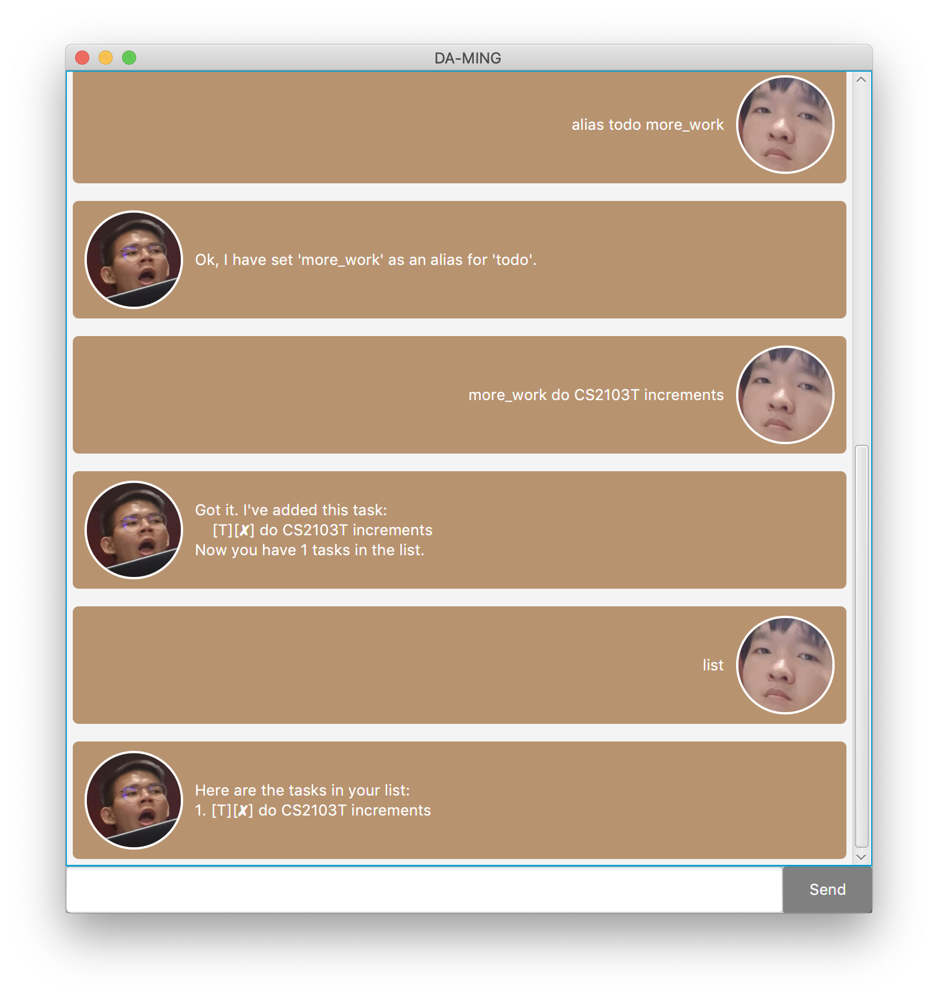

# DA-MING User Guide

## Features 

### Keep track of your tasks
Maintain all of your deadlines, todos, or events in one place.

### Mark completed tasks as done
If your task is complete, mark them as done!
Or delete them if you do not need them anymore!

### Rename commands
Don't like how I named the commands? Change them to fit you!

## Usage

### `todo` - Add a new Todo task

Adds a new task to be done.

Command: `todo <description>`

Aliases: `t`

### `deadline` - Add a new Deadline task

Adds a new task with a deadline to meet.

Command: `deadline <description> /by <time: ddmmyyyy hhmm>`

Aliases: `dead`

### `event` - Add a new Event task

Adds a new event and when it will happen.

Command: `event <description> /at <time: ddmmyyyy hhmm>`

Aliases: `e`

### `list` - List all tasks

List all tasks added into the task list.

Command: `list`

Aliases: `l`

### `find` - Find tasks

Finds related task containing a specific keyword(s).

Command: `find <keyword(s)>`

Aliases: `search`, `f`

### `done` - Mark task as done

Marks a task as done given its number.

Command: `done <task number>`

Aliases: `d`, `complete`, `completed`

### `delete` - Delete selected task

Deletes a task given its number.

Command: `delete <task number>`

Aliases: `del`

### `alias` - Add a new alias

Create a new alias for an existing command.

Command: `alias <command name> <new alias>`

Aliases: `a`

### `bye` - Exit Duke

Saves task list.

Command: `bye`

Aliases: `b`
